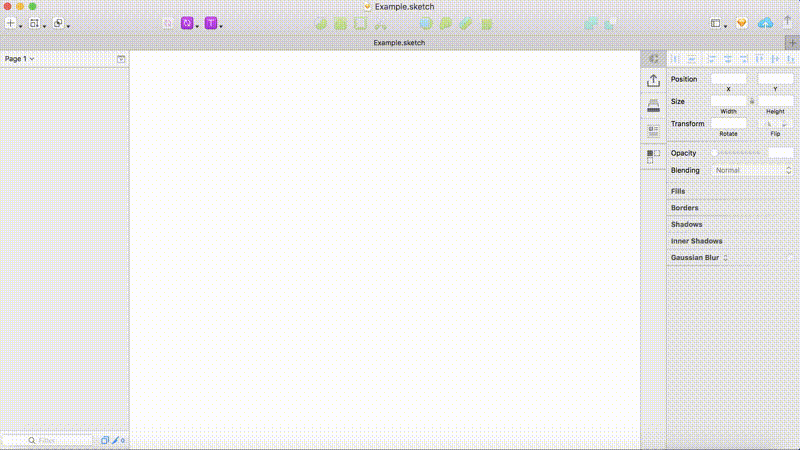
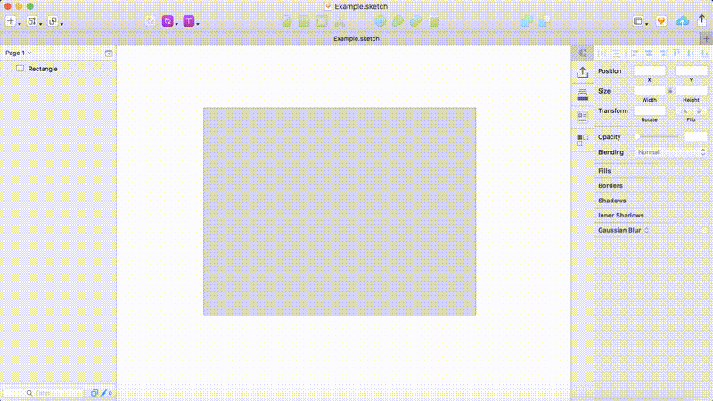
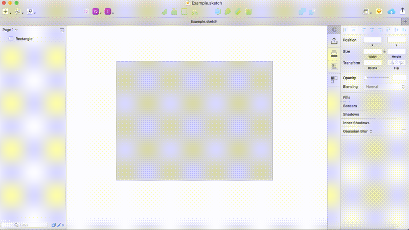

# 🗺 Sketch Maps

Sketch Maps is a plugin that uses the Mapbox API to fill layers with specific and custom maps.

## Usage

### Basic

### Options (Zoom, Bearing and Pitch)

### Custom Styles

In addition to 5 professionally designed styles provided by Mapbox, you can use custom styles designed in [Mapbox Studio](https://www.mapbox.com/mapbox-studio/) with their Style URL (`mapbox://styles/username/style`).

[Swiss Ski Style](https://github.com/mapbox/mapbox-gl-swiss-ski-style) from Mapbox.

## Attribution

If you hide the watermarks, you are legally required to [include proper attribution elsewhere on the document](https://www.mapbox.com/help/attribution/).

## Installation

Make sure you have the latest version of Sketch installed. **(Sketch 40+)**

1. [Download the ZIP file of this repository](https://github.com/bouchenoiremarc/Sketch-Maps/archive/master.zip)
2. Double click on `Sketch Maps.sketchplugin`

## Inspiration

Sketch Maps is heavily inspired by [Map Generator Sketch](https://github.com/eddiesigner/sketch-map-generator) from [Eduardo Gómez](https://twitter.com/_edev).

## License

Sketch Maps is released under the MIT license. See [LICENSE](LICENSE) for details.
